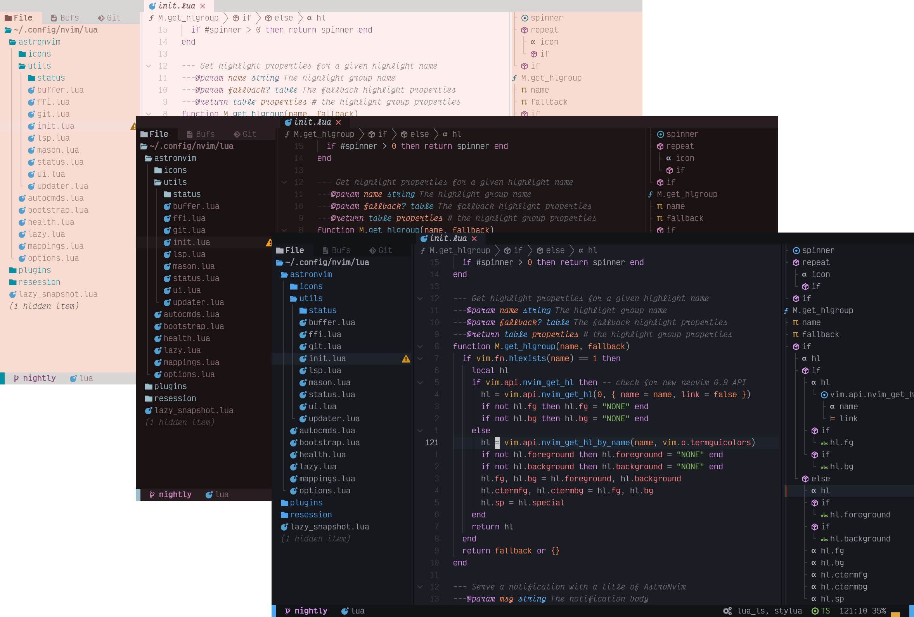

import { Tabs, TabItem } from '@astrojs/starlight/components';

::::danger

UNVALIDATED: NEED UPDATING FOR V4

::::


:::tip

When getting started, please be sure to check out the
[Frequently Asked Questions](/faq)!

:::




AstroNvim is an aesthetic and feature-rich neovim config that is extensible and easy to use with a great set of plugins

## ⚡ Requirements

- [Nerd Fonts](https://www.nerdfonts.com/font-downloads) (_Optional with manual intervention:_ See [Recipes/Customizing Icons](/recipes/icons#disable-icons)) <sup>[[1]](#1)</sup>
- [Neovim v0.8+ (_Not_ including nightly)](https://github.com/neovim/neovim/releases/tag/stable)
- [Tree-sitter CLI](https://github.com/tree-sitter/tree-sitter/blob/master/cli/README.md) (_Note:_ This is only necessary if you want to use `auto_install` feature with Treesitter)
- A clipboard tool is necessary for the integration with the system clipboard (see [`:help clipboard-tool`](https://neovim.io/doc/user/provider.html#clipboard-tool) for supported solutions)
- Terminal with true color support (for the default theme, otherwise it is dependent on the theme you are using) <sup>[[2]](#2)</sup>
- Optional Requirements:
  - [ripgrep](https://github.com/BurntSushi/ripgrep) - live grep telescope search (`<leader>fw`)
  - [lazygit](https://github.com/jesseduffield/lazygit) - git ui toggle terminal (`<leader>tl` or `<leader>gg`)
  - [go DiskUsage()](https://github.com/dundee/gdu) - disk usage toggle terminal (`<leader>tu`)
  - [bottom](https://github.com/ClementTsang/bottom) - process viewer toggle terminal (`<leader>tt`)
  - [Python](https://www.python.org/) - python repl toggle terminal (`<leader>tp`)
  - [Node](https://nodejs.org/en/) - Node is needed for a lot of the LSPs, and for the node repl toggle terminal (`<leader>tn`)


:::note

<sup id="1">[1]</sup> All downloadable Nerd Fonts contain icons which are used by AstroNvim. Install the Nerd Font of your choice to your system and in your terminal emulator settings, set its font face to that Nerd Font. If you are using AstroNvim on a remote system via SSH, you do not need to install the font on the remote system.

:::

:::note

<sup id="2">[2]</sup> When using default theme: For MacOS, the default terminal does not have true color support. You will need to use <a href="https://iterm2.com/">iTerm2</a>, <a href="https://sw.kovidgoyal.net/kitty/">Kitty</a>, <a href="https://wezfurlong.org/wezterm/">WezTerm</a>, or another <a href="https://github.com/termstandard/colors">terminal emulator</a> that has true color support.

:::

## 🛠️ Installation

<Tabs>

<TabItem value="nix" label="Linux/Mac OS (Unix)" default>

### Make a backup of your current nvim folder

```sh
mv ~/.config/nvim ~/.config/nvim.bak
```

#### Clean neovim folders (Optional but recommended)

```sh
mv ~/.local/share/nvim ~/.local/share/nvim.bak
mv ~/.local/state/nvim ~/.local/state/nvim.bak
mv ~/.cache/nvim ~/.cache/nvim.bak
```

### Clone the repository

```sh
git clone --depth 1 https://github.com/AstroNvim/AstroNvim ~/.config/nvim
nvim
```

</TabItem>

<TabItem value="windoze" label="Windows (PowerShell)" default>

### Make a backup of your current nvim folder

```powershell
Move-Item $env:LOCALAPPDATA\nvim $env:LOCALAPPDATA\nvim.bak
```

### Clean old plugins (Optional but recommended)

```powershell
Move-Item $env:LOCALAPPDATA\nvim-data $env:LOCALAPPDATA\nvim-data.bak
```

### Clone the repository

```powershell
git clone --depth 1 https://github.com/AstroNvim/AstroNvim $env:LOCALAPPDATA\nvim
nvim
```

</TabItem>

<TabItem value="docker" label="Docker" default>

If you want to try AstroNvim before installing you can use the following Docker command to open a test instance without touching your current Neovim configuration. This also allows you to use `:TSInstall` and `:LspInstall` to load and evaluate language servers and treesitter parsers as well.

```sh
docker run -w /root -it --rm alpine:edge sh -uelic '
  apk add bash git lua nodejs npm lazygit bottom python3 go neovim ripgrep alpine-sdk --update
  git clone --depth 1 https://github.com/AstroNvim/AstroNvim ~/.config/nvim
  # Uncomment the line below and replace the link with your user config repo to load a user config
  # git clone https://github.com/username/AstroNvim_user ~/.config/nvim/lua/user
  nvim
'
```

</TabItem>

</Tabs>

## 📦 Setup

### Install LSP

Enter `:LspInstall` followed by the name of the server you want to install

> Example: `:LspInstall pyright`

### Install language parser

Enter `:TSInstall` followed by the name of the language you want to install

> Example: `:TSInstall python`

### Install Debugger

Enter `:DapInstall` followed by the name of the debugger you want to install

> Example: `:DapInstall python`

### Manage plugins

Run `:Lazy check` to check for plugin updates

Run `:Lazy update` to apply any pending plugin updates

Run `:Lazy clean` to remove any disabled or unused plugins

Run `:Lazy sync` to update and clean plugins

### Update AstroNvim

Run `:AstroUpdate` (`<leader>pA`) to get the latest updates from the repository

### Update AstroNvim Packages

Run `:AstroUpdatePackages` (`<leader>pa`) to update both Neovim plugins and Mason packages

### Reload AstroNvim (_EXPERIMENTAL_)

Run `:AstroReload` to reload the AstroNvim configuration and any new user configuration changes without restarting. This is currently an experimental feature and may lead to instability until the next restart.

## ✨ Features

- Common plugin specifications with [AstroCommunity](https://github.com/AstroNvim/astrocommunity)
- Statusline, Winbar, and Tabline with [Heirline](https://github.com/rebelot/heirline.nvim)
- Plugin management with [lazy.nvim](https://github.com/folke/lazy.nvim)
- Package management with [mason.nvim](https://github.com/williamboman/mason.nvim)
- File explorer with [Neo-tree](https://github.com/nvim-neo-tree/neo-tree.nvim)
- Autocompletion with [Cmp](https://github.com/hrsh7th/nvim-cmp)
- Git integration with [Gitsigns](https://github.com/lewis6991/gitsigns.nvim)
- Terminal with [Toggleterm](https://github.com/akinsho/toggleterm.nvim)
- Fuzzy finding with [Telescope](https://github.com/nvim-telescope/telescope.nvim)
- Syntax highlighting with [Treesitter](https://github.com/nvim-treesitter/nvim-treesitter)
- Formatting and linting with [Null-ls](https://github.com/jose-elias-alvarez/null-ls.nvim)
- Language Server Protocol with [Native LSP](https://github.com/neovim/nvim-lspconfig)

## ⚙️ Configuration

To begin making custom user configurations you must create a `user/` folder. We have created a template repository for easily making a user configuration file: [Astronvim/user_example](https://github.com/AstroNvim/user_example)

The provided template repo can be used to create a new user configuration repository on your GitHub account or cloned directly. After creating a new repository from the template you can run:

```sh
git clone https://github.com/<username>/<config_repo> ~/.config/nvim/lua/user
```

## 📦 Community Plugin Configurations

To avoid duplication of effort, you can use community-provided setups from the [AstroCommunity repository](https://github.com/AstroNvim/astrocommunity). For example, to enable language tools (LSP and DAP etc.) for Rust and Python, your `plugins/community.lua` file can look like the following.

**Disclaimer: These setups might not always work. Think of them as VSCode extensions or AUR build scripts, separate from the main AstroNvim project. Report any issues to the [AstroCommunity](https://github.com/AstroNvim/astrocommunity) maintainers, not the AstroNvim maintainers.**

```lua
return {
  -- Add the community repository of plugin specifications
  "AstroNvim/astrocommunity",
  -- example of importing a plugin, comment out to use it or add your own
  -- available plugins can be found at https://github.com/AstroNvim/astrocommunity
  -- { import = "astrocommunity.colorscheme.catppuccin" },
  { import = "astrocommunity.pack.rust" },
  { import = "astrocommunity.pack.python" },
}
```

## ❗️ General tips

For more information on the organization of config files and general usage of AstroNvim, be sure to check out the excellent [youtube tutorial](https://www.youtube.com/watch?v=GEHPiZ10gOk).

More advanced LSP setups can also be found in [Recipes](/recipes/advanced_lsp). Note that whenever you see `plugins = { <inner_code_block> }`, you can also put the `<inner_code_block>` into `plugins/user.lua` or `plugins/*.lua` (they will all be merged into the final plugins spec, and the lua code `plugins = {...}` acts like the directory structure `plugins/...`).
