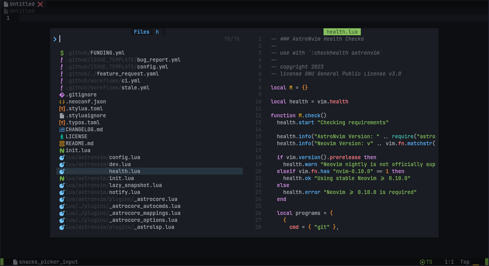

:::tip

This is available in the [AstroCommunity](https://github.com/AstroNvim/astrocommunity/tree/main/lua/astrocommunity/recipes/picker-nvchad-theme)

```lua title="lua/community.lua" ins={3}
return {
  "AstroNvim/astrocommunity",
  { import = "astrocommunity.recipes.picker-nvchad-theme" },
}
```

:::

This plugin specification makes the default theme `snacks.picker` look similar to the default NvChad picker theme:



## Plugin Specification

```lua title="lua/plugins/astroui.lua"
return {
  "AstroNvim/astroui",
  ---@type AstroUIOpts
  opts = {
    highlights = {
      -- set highlights for all themes
      -- use a function override to let us use lua to retrieve
      -- colors from highlight group there is no default table
      -- so we don't need to put a parameter for this function
      init = function()
        local get_hlgroup = require("astroui").get_hlgroup
        -- get highlights from highlight groups
        local bg = get_hlgroup("Normal").bg
        local bg_alt = get_hlgroup("Visual").bg
        local green = get_hlgroup("String").fg
        local red = get_hlgroup("Error").fg
        -- return a table of highlights for snacks.picker based on
        -- colors retrieved from highlight groups
        return {
          SnacksPickerBorder = { fg = bg_alt, bg = bg },
          SnacksPicker = { bg = bg },
          SnacksPickerPreviewBorder = { fg = bg, bg = bg },
          SnacksPickerPreview = { bg = bg },
          SnacksPickerPreviewTitle = { fg = bg, bg = green },
          SnacksPickerBoxBorder = { fg = bg, bg = bg },
          SnacksPickerInputBorder = { fg = bg, bg = bg },
          SnacksPickerInputSearch = { fg = red, bg = bg },
          SnacksPickerListBorder = { fg = bg, bg = bg },
          SnacksPickerList = { bg = bg },
          SnacksPickerListTitle = { fg = bg, bg = bg },
        }
      end,
    },
  },
}
```
