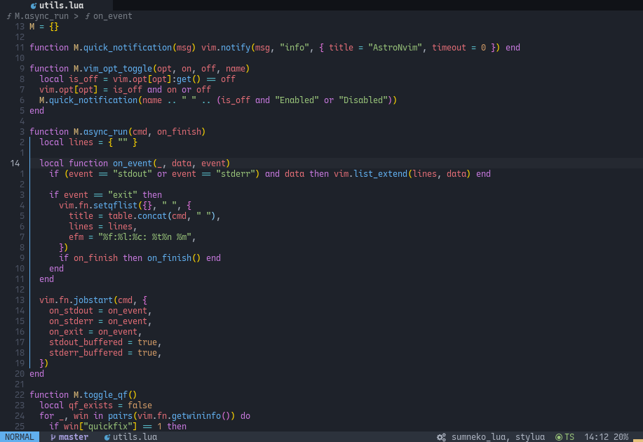

AstroNvim uses [`Heirline.nvim`](https://github.com/rebelot/heirline.nvim) for both the custom statusline, tabline, and winbar. Heirline is an extremely minimal statusline plugin that does not come with any preconfigured elements but focuses on speed and extensibility. To build our statusline, we have built a Lua API of elements into [AstroUI](https://github.com/AstroNvim/astroui) that we use to build our own statusline. This can in turn be used in your user configuration to customize the statusline, tabline, and winbar.

:::caution

Customizing the statusline can be very manual and require a lot of knowledge of the API that we have provided. It is **highly** recommended to only do this if you are comfortable with programming Lua and reading the source code of AstroNvim.

We have provided a couple recipes below for common use cases that can be copy/pasted without needing to worry about the API.

:::

## Basic Options

There are some basic options that we have set up in AstroUI to configure our internal status API. These options are used to easily change things like the colors of sections and the separators used for sections. These would be in a top level `status` table in your AstroUI plugin configuration options.

- `status.attributes` provides an easy way to override the highlight attributes for each component that we provide in the `status` API. The available options here can be found with `:h attr-list`. Similar to the `status.colors` table, we have set the key values corresponding to the names of the components in `require("astroui.status").component` Any component can be given attributes.

- `status.colors` provides an easy way to override the color of each component that we provide in the statusline. We have provided the default options for these which are derived from the current theme that is loaded. The values that we show are the highlight group name and the property that they are using. We also set values such as `git_branch_fg` and `treesitter_fg`, corresponding to the names of components in `require("astroui.status").component`. Any component can be given a color here followed by `_fg` and `_bg` to control the foreground and background colors. If a value is not provided then it defaults to `section_fg` and `section_bg`. We do not use custom colors for the other sections by default which is why only `git_branch_fg` and `treesitter_fg` are set.

- `status.icon_highlights` lets you easily control when breadcrumbs and filetype icons should be dynamically or statically colored. By default, LSP breadcrumbs have highlighting disabled and the filetype icon is colored in the statusline, colored for active and visible buffers in the tabline, and disabled in the winbar. These values can either be `true` or `false` to enable/disable them always, or a function where the first component is the Heirline component for doing dynamic changing when to color the icon.

- `status.separators` provides an easy way to change the character that surrounds your statusline components. The key is the side of the component and the two characters are the characters to be put on the left and right of the component respectively.

Default Options:

```lua
local status = {
  separators = {
    none = { "", "" },
    left = { "", "  " },
    right = { "  ", "" },
    center = { "  ", "  " },
    tab = { "", " " },
    breadcrumbs = "  ",
    path = "  ",
  },
  colors = {
    fg = StatusLine.fg,
    bg = StatusLine.bg,
    section_fg = StatusLine.fg,
    section_bg = StatusLine.bg,
    git_branch_fg = Conditional.fg,
    treesitter_fg = String.fg,
    scrollbar = TypeDef.fg,
    git_added = GitSignsAdd.fg,
    git_changed = GitSignsChange.fg,
    git_removed = GitSignsDelete.fg,
    diag_ERROR = DiagnosticError.fg,
    diag_WARN = DiagnosticWarn.fg,
    diag_INFO = DiagnosticInfo.fg,
    diag_HINT = DiagnosticHint.fg,
    winbar_fg = WinBar.fg,
    winbar_bg = WinBar.bg,
    winbarnc_fg = WinBarNC.fg,
    winbarnc_bg = WinBarNC.bg,
    tabline_bg = StatusLine.bg,
    tabline_fg = StatusLine.bg,
    buffer_fg = Comment.fg,
    buffer_path_fg = WinBarNC.fg,
    buffer_close_fg = Comment.fg,
    buffer_bg = StatusLine.bg,
    buffer_active_fg = Normal.fg,
    buffer_active_path_fg = WinBarNC.fg,
    buffer_active_close_fg = Error.fg,
    buffer_active_bg = Normal.bg,
    buffer_visible_fg = Normal.fg,
    buffer_visible_path_fg = WinBarNC.fg,
    buffer_visible_close_fg = Error.fg,
    buffer_visible_bg = Normal.bg,
    buffer_overflow_fg = Comment.fg,
    buffer_overflow_bg = StatusLine.bg,
    buffer_picker_fg = Error.fg,
    tab_close_fg = Error.fg,
    tab_close_bg = StatusLine.bg,
    tab_fg = TabLine.fg,
    tab_bg = TabLine.bg,
    tab_active_fg = TabLineSel.fg,
    tab_active_bg = TabLineSel.bg,
    inactive = HeirlineInactive.fg,
    normal = HeirlineNormal.fg,
    insert = HeirlineInsert.fg,
    visual = HeirlineVisual.fg,
    replace = HeirlineReplace.fg,
    command = HeirlineCommand.fg,
    terminal = HeirlineTerminal.fg,
  },
  attributes = {
    buffer_active = { bold = true, italic = true },
    buffer_picker = { bold = true },
    macro_recording = { bold = true },
    git_branch = { bold = true },
    git_diff = { bold = true },
  },
  icon_highlights = {
    breadcrumbs = false,
    file_icon = {
      tabline = function(self)
        return self.is_active or self.is_visible
      end,
      statusline = true,
      winbar = false,
    },
  },
}
```

## Using `astroui.status` Module

AstroUI provides a module that can be loaded with `require("astroui.status")` for building components in Heirline for the statusline, tabline, and winbar. It has several submodules:

:::note

For the complete documentation on this API checkout the [AstroUI Lua API docs](https://git.astronvim.com/astroui/blob/main/doc/api.md)

:::

| Module                     | Description                                                                                                                                   |
| -------------------------- | --------------------------------------------------------------------------------------------------------------------------------------------- |
| `astroui.status`           | Easily import all of the below modules                                                                                                        |
| `astroui.status.component` | A collection of methods to assist in building entire components. This is the main piece to interact with when building custom statuslines     |
| `astroui.status.hl`        | A collection of methods to assist in setting the color of a component                                                                         |
| `astroui.status.provider`  | A collection of methods that can be set as Heirline providers                                                                                 |
| `astroui.status.condition` | A collection of methods that can be use as Heirline conditions for controlling when components are enabled                                    |
| `astroui.status.init`      | A collection of methods that can be set as Heirline init functions for building components with dynamic subcomponents such as LSP breadcrumbs |
| `astroui.status.utils`     | A collection of miscellaneous helper functions that `astroui.status` uses such as surrounding components and getting buffers                  |
| `astroui.status.env`       | A place to store globally accessible variables such as separators, mode text, etc.                                                            |
| `astroui.status.heirline`  | A collection of tools specific for Heirline as well as a few aliases for easily interfacing with Heirline utilities                           |

Heirline is built through building up components in a nested way, where each component either has it's own sub components or a provider to tell what content should be displayed. For a detailed description on the basic concepts of configuring Heirline, please check out their extremely well written [cookbook](https://github.com/rebelot/heirline.nvim/blob/master/cookbook.md).

### Building a Component From Scratch

To build a component from the ground up, we can first start by selecting a `provider` from the `require("astroui.status").provider` module, for example we can use the `require("astroui.status").provider.mode_text` provider to get the text for the current mode (i.e. `NORMAL`, `INSERT`, etc.). Each provider takes a single argument table with options. Some providers have their own options, but all have a common set of options for stylizing the string they provide. These options include padding, separator characters, and an icon to be used.

Using these options we can start building our component:

```lua {2-4}
local status = require("astroui.status")
local component = {
  provider = status.provider.mode_text({ padding = { left = 1, right = 1 } }),
}
```

This will give us a component where the text will be the current mode displayed as text. But now we want to be able to have the background of the mode to change colors along with the mode. This is where the `require("astronvim.utils.status").hl` module comes into play. There is a method there for getting the highlight for a mode with `require("astronvim.utils.status").hl.mode`. Each of these `hl` methods are designed to be passed in by name instead of resolving the function to the `hl` field in a Heirline component. For example, we can add the mode highlighting to our component as such:

```diff lang="lua"
local status = require("astroui.status")
local component = {
  provider = status.provider.mode_text({ padding = { left = 1, right = 1 } }),
+  hl = status.hl.mode,
}
```

This will give us a simple component where the background changes colors with each mode and displays the text of the current mode. If we want to make this component a bit prettier and add surrounding characters, we can use the `require("astronvim.utils.status").utils.surround` function with our component to do this. This surround method also handles setting the highlight group so we no longer need to set that inside of our component. An example of this would be:

```diff lang="lua"
local status = require("astroui.status")
local component = {
  provider = status.provider.mode_text({ padding = { left = 1, right = 1 } }),
-  hl = status.hl.mode,
}
+local surrounded_component =
+  status.utils.surround({ "", " " }, status.hl.mode_bg, component)
```

This function takes three parameters: the first parameter (left and right side respectively), the second parameter is the function for setting the color for the background of the component and the foreground of the separators, and the third parameter is the component that should be surrounded. In turn it gives us our final component that can be used inside of Heirline.

### Using the Predefined Components in `require("astroui.status").component`

Building components from scratch is a powerful method that gives users complete control, but for the most part it's nice to have fully built components without having to think as much about what's going on internally. For this we have created several out of the box component building functions for things such as the mode, file details, git information, etc. With these, it becomes much easier to build components that you would want in your statusline. For example, to recreate our previous mode text component we can do this:

```lua {2-4}
local status = require("astroui.status")
local component = status.component.mode({
  mode_text = { padding = { left = 1, right = 1 } },
})
```

This will automatically set up the surrounding and colors that we want and defaults to it being a left aligned component. If you are going to place the component on the right side and want it to have the right side separators instead, you can do this:

```diff lang="lua"
local status = require("astroui.status")
local component = status.component.mode({
  mode_text = { padding = { left = 1, right = 1 } },
+  surround = { separator = "right" },
})
```

## Default Heirline Configuration

This is a code block that redefines the default statusline and winbar that are used in AstroNvim inside of the user configuration file for reference and a starting point to make modifications:

```lua title="lua/plugins/heirline.lua"
return {
  "rebelot/heirline.nvim",
  opts = function(_, opts)
    local status = require("astroui.status")

    opts.statusline = { -- statusline
      hl = { fg = "fg", bg = "bg" },
      status.component.mode(),
      status.component.git_branch(),
      status.component.file_info({
        filetype = {},
        filename = false,
        file_modified = false,
      }),
      status.component.git_diff(),
      status.component.diagnostics(),
      status.component.fill(),
      status.component.cmd_info(),
      status.component.fill(),
      status.component.lsp(),
      status.component.virtual_env(),
      status.component.treesitter(),
      status.component.nav(),
      status.component.mode({ surround = { separator = "right" } }),
    }

    opts.winbar = { -- winbar
      init = function(self)
        self.bufnr = vim.api.nvim_get_current_buf()
      end,
      fallthrough = false,
      { -- inactive winbar
        condition = function()
          return not status.condition.is_active()
        end,
        status.component.separated_path(),
        status.component.file_info({
          file_icon = {
            hl = status.hl.file_icon("winbar"),
            padding = { left = 0 },
          },
          file_modified = false,
          file_read_only = false,
          hl = status.hl.get_attributes("winbarnc", true),
          surround = false,
          update = "BufEnter",
        }),
      },
      { -- active winbar
        status.component.breadcrumbs({
          hl = status.hl.get_attributes("winbar", true),
        }),
      },
    }

    opts.tabline = { -- tabline
      { -- file tree padding
        condition = function(self)
          self.winid = vim.api.nvim_tabpage_list_wins(0)[1]
          return status.condition.buffer_matches(
            { filetype = { "aerial", "dapui_.", "neo%-tree", "NvimTree" } },
            vim.api.nvim_win_get_buf(self.winid)
          )
        end,
        provider = function(self)
          return string.rep(" ", vim.api.nvim_win_get_width(self.winid) + 1)
        end,
        hl = { bg = "tabline_bg" },
      },
      status.heirline.make_buflist(status.component.tabline_file_info()), -- component for each buffer tab
      status.component.fill({ hl = { bg = "tabline_bg" } }), -- fill the rest of the tabline with background color
      { -- tab list
        condition = function()
          return #vim.api.nvim_list_tabpages() >= 2
        end, -- only show tabs if there are more than one
        status.heirline.make_tablist({ -- component for each tab
          provider = status.provider.tabnr(),
          hl = function(self)
            return status.hl.get_attributes(
              status.heirline.tab_type(self, "tab"),
              true
            )
          end,
        }),
        { -- close button for current tab
          provider = status.provider.close_button({
            kind = "TabClose",
            padding = { left = 1, right = 1 },
          }),
          hl = status.hl.get_attributes("tab_close", true),
          on_click = {
            callback = function()
              require("astronvim.utils.buffer").close_tab()
            end,
            name = "heirline_tabline_close_tab_callback",
          },
        },
      },
    }

    opts.statuscolumn = { -- statuscolumn
      status.component.foldcolumn(),
      status.component.fill(),
      status.component.numbercolumn(),
      status.component.signcolumn(),
    }
  end,
}
```

## Default Statusline With Mode Text

Some users want to be able to add the mode text to their statusline easily, AstroUI's `astroui.status` lua module as well as Heirline make that very easy to do in their user configuration file.



Heirline plugin specification that adds the mode text to the statusline:

```lua title="lua/plugins/heirline.lua"
return {
  "rebelot/heirline.nvim",
  opts = function(_, opts)
    local status = require("astroui.status")
    opts.statusline = { -- statusline
      hl = { fg = "fg", bg = "bg" },
      status.component.mode({
        mode_text = { padding = { left = 1, right = 1 } },
      }), -- add the mode text
      status.component.git_branch(),
      status.component.file_info({
        filetype = {},
        filename = false,
        file_modified = false,
      }),
      status.component.git_diff(),
      status.component.diagnostics(),
      status.component.fill(),
      status.component.cmd_info(),
      status.component.fill(),
      status.component.lsp(),
      status.component.virtual_env(),
      status.component.treesitter(),
      status.component.nav(),
      -- remove the 2nd mode indicator on the right
    }
  end,
}
```

## Replicate NvChad Statusline

NvChad comes with a very specific statusline configuration that a lot of people like, so we figured it would be a nice exercise of the extensibility of our `astronvim.utils.status` API to show how to build that statusline in AstroNvim. _Warning:_ This is a fairly complicated example and is meant to be used by people who want it and to demonstrate how much you can customize the statusline.


Plugin specification that recreates the NvChad statusline in AstroNvim:

```lua title="lua/plugins/nvchad_statusline.lua"
return {
  {
    "AstroNvim/astroui",
    ---@type AstroUIOpts
    opts = {
      -- add new user interface icon
      icons = {
        VimIcon = "",
        ScrollText = "",
        GitBranch = "",
        GitAdd = "",
        GitChange = "",
        GitDelete = "",
      },
      -- modify variables used by heirline but not defined in the setup call directly
      status = {
        -- define the separators between each section
        separators = {
          left = { "", " " }, -- separator for the left side of the statusline
          right = { " ", "" }, -- separator for the right side of the statusline
          tab = { "", "" },
        },
        -- add new colors that can be used by heirline
        colors = function(hl)
          local get_hlgroup = require("astrocore").get_hlgroup
          -- use helper function to get highlight group properties
          local comment_fg = get_hlgroup("Comment").fg
          hl.git_branch_fg = comment_fg
          hl.git_added = comment_fg
          hl.git_changed = comment_fg
          hl.git_removed = comment_fg
          hl.blank_bg = get_hlgroup("Folded").fg
          hl.file_info_bg = get_hlgroup("Visual").bg
          hl.nav_icon_bg = get_hlgroup("String").fg
          hl.nav_fg = hl.nav_icon_bg
          hl.folder_icon_bg = get_hlgroup("Error").fg
          return hl
        end,
        attributes = {
          mode = { bold = true },
        },
        icon_highlights = {
          file_icon = {
            statusline = false,
          },
        },
      },
    },
  },
  {
    "rebelot/heirline.nvim",
    opts = function(_, opts)
      local status = require("astroui.status")
      opts.statusline = {
        -- default highlight for the entire statusline
        hl = { fg = "fg", bg = "bg" },
        -- each element following is a component in astroui.status module

        -- add the vim mode component
        status.component.mode({
          -- enable mode text with padding as well as an icon before it
          mode_text = {
            icon = { kind = "VimIcon", padding = { right = 1, left = 1 } },
          },
          -- surround the component with a separators
          surround = {
            -- it's a left element, so use the left separator
            separator = "left",
            -- set the color of the surrounding based on the current mode using astronvim.utils.status module
            color = function()
              return { main = status.hl.mode_bg(), right = "blank_bg" }
            end,
          },
        }),
        -- we want an empty space here so we can use the component builder to make a new section with just an empty string
        status.component.builder({
          { provider = "" },
          -- define the surrounding separator and colors to be used inside of the component
          -- and the color to the right of the separated out section
          surround = {
            separator = "left",
            color = { main = "blank_bg", right = "file_info_bg" },
          },
        }),
        -- add a section for the currently opened file information
        status.component.file_info({
          -- enable the file_icon and disable the highlighting based on filetype
          file_icon = { padding = { left = 0 } },
          filename = { fallback = "Empty" },
          -- add padding
          padding = { right = 1 },
          -- define the section separator
          surround = { separator = "left", condition = false },
        }),
        -- add a component for the current git branch if it exists and use no separator for the sections
        status.component.git_branch({ surround = { separator = "none" } }),
        -- add a component for the current git diff if it exists and use no separator for the sections
        status.component.git_diff({
          padding = { left = 1 },
          surround = { separator = "none" },
        }),
        -- fill the rest of the statusline
        -- the elements after this will appear in the middle of the statusline
        status.component.fill(),
        -- add a component to display if the LSP is loading, disable showing running client names, and use no separator
        status.component.lsp({
          lsp_client_names = false,
          surround = { separator = "none", color = "bg" },
        }),
        -- fill the rest of the statusline
        -- the elements after this will appear on the right of the statusline
        status.component.fill(),
        -- add a component for the current diagnostics if it exists and use the right separator for the section
        status.component.diagnostics({ surround = { separator = "right" } }),
        -- add a component to display LSP clients, disable showing LSP progress, and use the right separator
        status.component.lsp({
          lsp_progress = false,
          surround = { separator = "right" },
        }),
        -- NvChad has some nice icons to go along with information, so we can create a parent component to do this
        -- all of the children of this table will be treated together as a single component
        {
          -- define a simple component where the provider is just a folder icon
          status.component.builder({
            -- astronvim.get_icon gets the user interface icon for a closed folder with a space after it
            { provider = require("astroui").get_icon("FolderClosed") },
            -- add padding after icon
            padding = { right = 1 },
            -- set the foreground color to be used for the icon
            hl = { fg = "bg" },
            -- use the right separator and define the background color
            surround = { separator = "right", color = "folder_icon_bg" },
          }),
          -- add a file information component and only show the current working directory name
          status.component.file_info({
            -- we only want filename to be used and we can change the fname
            -- function to get the current working directory name
            filename = {
              fname = function(nr)
                return vim.fn.getcwd(nr)
              end,
              padding = { left = 1 },
            },
            -- disable all other elements of the file_info component
            file_icon = false,
            file_modified = false,
            file_read_only = false,
            -- use no separator for this part but define a background color
            surround = {
              separator = "none",
              color = "file_info_bg",
              condition = false,
            },
          }),
        },
        -- the final component of the NvChad statusline is the navigation section
        -- this is very similar to the previous current working directory section with the icon
        { -- make nav section with icon border
          -- define a custom component with just a file icon
          status.component.builder({
            { provider = require("astroui").get_icon("ScrollText") },
            -- add padding after icon
            padding = { right = 1 },
            -- set the icon foreground
            hl = { fg = "bg" },
            -- use the right separator and define the background color
            -- as well as the color to the left of the separator
            surround = {
              separator = "right",
              color = { main = "nav_icon_bg", left = "file_info_bg" },
            },
          }),
          -- add a navigation component and just display the percentage of progress in the file
          status.component.nav({
            -- add some padding for the percentage provider
            percentage = { padding = { right = 1 } },
            -- disable all other providers
            ruler = false,
            scrollbar = false,
            -- use no separator and define the background color
            surround = { separator = "none", color = "file_info_bg" },
          }),
        },
      }
    end,
  },
}
```

## Replicate Visual Studio Code Winbar

Visual Studio Code has a default bar at the top of files that many users may prefer to AstroNvim's default. Their `winbar` shows the path to the current file (relative to the working directory) along with the LSP provided breadcrumbs. This is achievable through our status API as well!


Plugin specification that recreates the winbar in Visual Studio Code:

```lua title="lua/plugins/vscode_winbar.lua"
return {
  "rebelot/heirline.nvim",
  opts = function(_, opts)
    local status = require("astroui.status")

    opts.winbar = { -- create custom winbar
      -- store the current buffer number
      init = function(self)
        self.bufnr = vim.api.nvim_get_current_buf()
      end,
      fallthrough = false, -- pick the correct winbar based on condition
      -- inactive winbar
      {
        condition = function()
          return not status.condition.is_active()
        end,
        -- show the path to the file relative to the working directory
        status.component.separated_path({
          path_func = status.provider.filename({ modify = ":.:h" }),
        }),
        -- add the file name and icon
        status.component.file_info({
          file_icon = {
            hl = status.hl.file_icon("winbar"),
            padding = { left = 0 },
          },
          file_modified = false,
          file_read_only = false,
          hl = status.hl.get_attributes("winbarnc", true),
          surround = false,
          update = "BufEnter",
        }),
      },
      -- active winbar
      {
        -- show the path to the file relative to the working directory
        status.component.separated_path({
          path_func = status.provider.filename({ modify = ":.:h" }),
        }),
        -- add the file name and icon
        status.component.file_info({ -- add file_info to breadcrumbs
          file_icon = { hl = status.hl.filetype_color, padding = { left = 0 } },
          file_modified = false,
          file_read_only = false,
          hl = status.hl.get_attributes("winbar", true),
          surround = false,
          update = "BufEnter",
        }),
        -- show the breadcrumbs
        status.component.breadcrumbs({
          icon = { hl = true },
          hl = status.hl.get_attributes("winbar", true),
          prefix = true,
          padding = { left = 0 },
        }),
      },
    }
  end,
}
```
